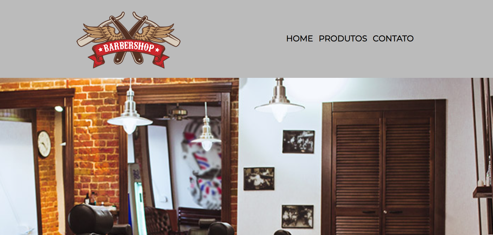

# Barbearia Generic

Bem-vindo ao projeto **Barbearia Generic**! Este é um site fictício para uma barbearia, desenvolvido com o objetivo de aprendizado e prática.

## Tecnologias Utilizadas

  

    
  

  

    
  

## Descrição

O projeto consiste em um site simples para uma barbearia, apresentando informações sobre a barbearia, serviços oferecidos, horário de funcionamento e formas de contato.
Este projeto tem grande apelo emocional para mim, pois foi o meu primeiro projeto utilizando HTML dentro do mundo Front-end.

## Conteúdo

- **Páginas:**

  - **Home:** Página inicial com uma breve descrição da barbearia e um banner destacando seus serviços.
  - **Sobre:** Informações sobre a história e missão da Barbearia Generic.
  - **Produtos:** Destaque para os produtos oferecidos pela barbearia.
  - **Contato:** Formulário de contato e informações de localização.

- **Recursos:**

  - **Imagens:** Logotipo, banners e imagens ilustrativas para tornar o site visualmente atraente.
  - **Vídeo:** Incorporação de um vídeo promocional na seção de benefícios.
  - **Google Maps:** Mapa interativo para mostrar a localização da barbearia.

- **Estilo:**
  - **Cores:** Esquema de cores consistente usando tons de cinza e laranja.
  - **Fontes:** Utilização da fonte "Montserrat" para uma aparência moderna.
